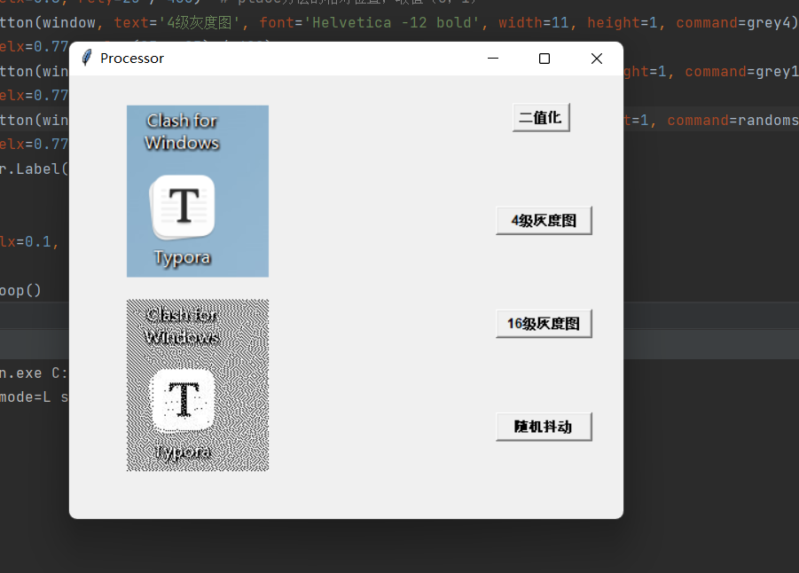

# Photo	图像转换小工具

课设周花了点时间写的小工具，以后可能会用到，主要是用来做一些简单的图像转换，图个方便。

使用方法：点一下

图像位置：会在本工具同目录下生成

 > 

 > 	
 >     
示例
 
 >     

二值化：根据给定阈值把图像变成只有纯黑（）和纯白（255）像素点的图像

灰度图：0到最大值等分量化

随机抖动算法：一种用二值像素模拟灰度图像的算法，相当于一定程度上的近视眼，当然了，会牺牲图像的分辨率

具体的模拟原理可以参见：

- https://zhuanlan.zhihu.com/p/60325181
- https://zh.wikipedia.org/wiki/%E6%8A%96%E5%8B%95_(%E6%95%B8%E4%BD%8D%E8%A8%8A%E8%99%9F%E8%99%95%E7%90%86)

